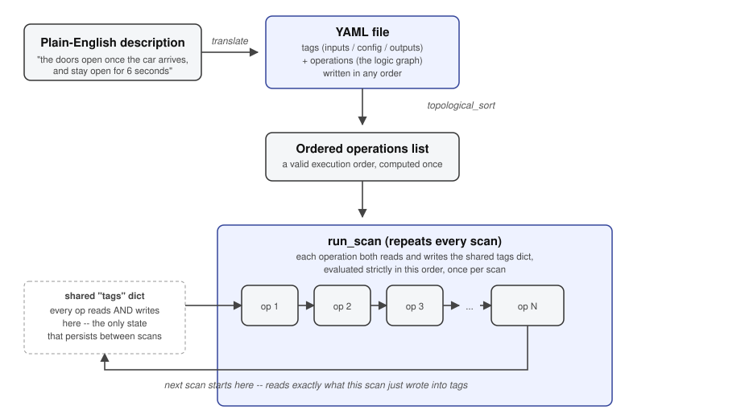
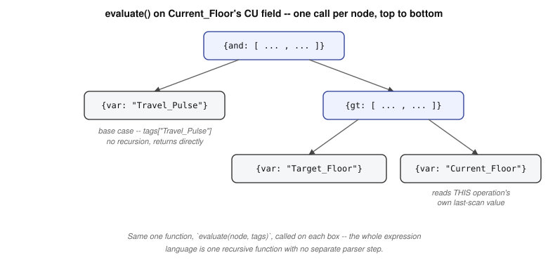
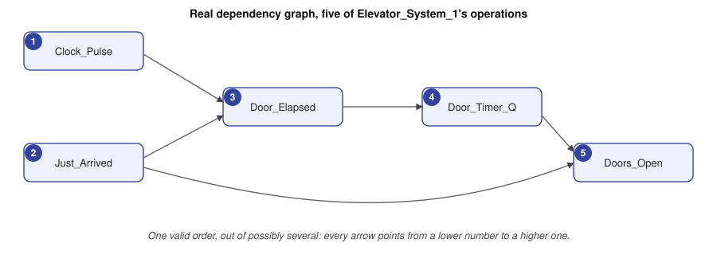
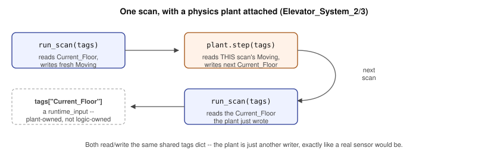

# Engine Internals

This is how `engine/` turns a YAML description into an executing system.

The YAML side of the project rests on the idea that a system can be expressed through a finite vocabulary of fundamental operations and known values. The engine is the corresponding computational half: a small, modular interpreter capable of taking anything validly expressed in that vocabulary and making it execute.

The diagram below captures the whole principle. The rest of this document takes it apart piece by piece.



A YAML file is loaded once, resolved into a valid execution order once, and then `run_scan()` evaluates every operation in that order, scan after scan — the same read-decide-act-repeat rhythm at the heart of a PLC or microcontroller.


## `evaluate()`: making the representation executable

The Syntax section of the YAML guide makes a design claim: arbitrarily complex logic can be constructed from a small set of fundamental operations arranged as recursive dictionaries and lists.

`evaluate()` is where that claim stops being descriptive and becomes computational.

There is no intermediate stage that first translates a JsonLogic expression into some second internal language. `evaluate(node, tags)` *is* the interpreter. It examines the single key of one dictionary and either resolves a value directly (`var`, the base case) or recursively evaluates whatever sub-nodes that operation contains (`and`, `gt`, `if`, ...).

That correspondence is the important part. Because the language itself is recursive, its interpreter can be recursive too.

An expression of arbitrary depth therefore requires no explicit stack, no separate tree-building pass, and no special knowledge of how deeply it is nested. The Python call stack supplies the traversal naturally: dictionaries contain lists, lists contain dictionaries, and `evaluate()` simply follows the same structure until it reaches a value.



Concretely, consider `Current_Floor`'s `CU` field:

```python
{and: [{var: "Travel_Pulse"}, {gt: [{var: "Target_Floor"}, {var: "Current_Floor"}]}]}
```

Evaluating it begins with one call to `evaluate()`. That call sees `and` and evaluates its two children. The second child sees `gt` and evaluates two more children; both are `var` nodes, the base case, resolved directly through `tags[...]`.

Four calls in total. One function.

Nothing about that function changes when the expression becomes deeper. The six-level `Target_Floor` dispatch tree from the YAML guide passes through exactly the same mechanism.

`topological_sort.py`'s `collect_vars()` exploits the same structural property for a completely different purpose. Instead of traversing the tree to *compute* its value, it traverses it to *discover every tag referenced inside it*, allowing `graph_builder()` to determine what an operation depends on.

The representation remains the same; only the question asked of it changes.

One recursive tree can therefore support both execution and structural analysis: **evaluate the tree, or inventory the tree.**


## Tags: the world model

There is exactly one piece of shared state in the engine: a plain Python dictionary called `tags`.

Every input, every constant, and every operation output — the entire observable condition of the simulated system at a particular instant — exists in that dictionary. Operations interact with the system by reading and writing named values through `tags["SomeName"]`.

Its simplicity is deliberate.

The engine does not contain an object representing “the elevator” or “the traffic light,” equipped with domain-specific methods and behaviour. Instead, it represents a world as a set of named values and a sequence of small operations, each of which reads some subset of those values and writes one result back.

Complexity therefore emerges from the composition of many simple operations, rather than being concentrated inside a single clever one.

At the centre of the engine, `run_scan()` in `scan_cycle.py` is little more than this:

```python
def run_scan(operations, fb_instances, tags):
    for op in operations:
        op_type = op["type"]
        if op_type in STATELESS_TYPES:
            result = evaluate(op["expression"], tags)
        else:
            instance = fb_instances[op["name"]]
            result = instance.check(op, tags)   # or .control_loop() for PID
        tags[op["output"]] = result
```

An entire elevator's dispatch, motion gating, and door sequencing emerges from this loop passing over roughly thirty small operations every scan, rather than from one large procedure attempting to decide the system's behaviour as a whole.

That is a deliberate trade: **many small, independently readable transformations over shared state instead of one monolithic procedure.** It is also recognisably close to the structure of PLC programming itself, where behaviour is assembled from individual rungs, statements, and function blocks rather than hidden inside one central routine.

One distinction matters here. `tags` is the only state that persists across scans *under declarative control*. Stateful function blocks in `function_blocks.py` also maintain small pieces of private Python state — `self.elapsed` for a `TON`, `self.counter` for a `CTUD` — stored in one object per stateful operation and constructed once by `build_fb_instances()`.

That state is real and persistent, but it is intentionally private. It does not become another communication channel through the system. The only information one operation can observe from another is the value that operation deliberately exposes through `tags`.

The distinction keeps the declarative graph legible even when its individual blocks carry memory.


## Topological sort: solving the execution order once

The YAML is written in whatever order best communicates the system to a human. The engine therefore has to derive the order required by the computation.

This is not an implementation convenience. It is what allows presentation order and execution order to be independent.

Without it, a scan would only be correct if an operation such as `Doors_Open` happened to appear after every operation whose output it reads. The author would be manually encoding dependencies through file position — information the expressions themselves already contain.

Instead, the engine extracts those dependencies and solves the ordering problem once.



```python
graph = graph_builder(raw_operations)
order = topological_sorter(graph)
lookout = build_operation_lookout(raw_operations)
operations = [lookout[name] for name in order]   # this is what run_scan takes
```

`graph_builder()` walks every operation using the same recursive traversal described above, finds each `{var: "X"}` reference, and creates a dependency edge whenever `X` is produced by another operation. Self-references are deliberately excluded; that exception deserves its own section below.

Function blocks complicate the search slightly because their logic does not live under a single `expression` field. An `RS` uses `Set` and `Reset`; a `CTUD` uses `CU`, `CD`, `R`, and `LD`; a `TON` uses `IN` and `PT`.

`collect_operation_vars()` therefore does not try to predict where dependencies will appear. It walks every field except a small set of metadata keys (`name`, `type`, `output`, `note`, `source`, `load_value`) and collects whatever tag references it encounters.

The result is deliberately plain:

```python
{operation_name: [names_of_operations_it_depends_on]}
```

`topological_sorter()` itself does not reimplement the sorting algorithm. It is a thin wrapper around Python's standard-library `graphlib.TopologicalSorter`, which exists precisely for this class of problem.

It is worth understanding what `static_order()` is solving, because “sorting the operations” makes the mechanism sound more arbitrary than it is.

Every operation begins by waiting for the operations it depends on. Any operation with no unresolved dependencies is *ready* and can be emitted. Once emitted, it releases the operations that were waiting on it; some of those may now become ready themselves. The process repeats until every operation has been emitted in an order where no operation appears before something it requires.

A cycle is the exact case in which this process cannot finish. A group of operations remains permanently unresolved because every member is still waiting for another member of the same group. None can become ready.

That structural impossibility is what surfaces as `CycleError`.

The important consequence is simple: **the YAML never has to encode execution order manually.** The dependency graph already contains that information, so the engine derives it once at load time and reuses the resulting order for every scan.


## Cycles, and the exception that makes self-reference possible

If operation A reads a tag produced by B, while B — directly or through other operations — depends on a tag produced by A, the graph contains a dependency **cycle**.

There is no valid single-pass ordering for such a graph, so `topological_sorter()` raises `CycleError` rather than silently imposing an arbitrary one.

This matters more than it might initially appear. “X determines Y, and Y's outcome should affect X” is a perfectly natural relationship to describe in plain language. Computationally, however, it asks a single scan to know a result before that result can be produced.

There is one deliberate exception.

An operation may read **its own output tag** without creating a dependency edge. `graph_builder()` explicitly removes that edge.

That is what allows a timer to inspect its previous output, a counter to compare against its own position, or an accumulator to build on its previous value. The operation's output from the preceding scan already exists in `tags`; no other operation needs to be executed first to make that value available.

The exemption is intentionally narrow. It applies to literal self-reference only. Two operations referencing one another still form a genuine cycle, regardless of how many intermediate operations connect them.


### Why ownership of a tag matters

The elevator provides a useful example because the distinction changes what can be expressed without changing the underlying logic.

A LOOK-style dispatch algorithm needs to compare pending calls with the car's current position.

In `Elevator_System_1`, `Current_Floor` is itself produced by a `CTUD` operation. If `Target_Floor` reads `Current_Floor` while `Current_Floor` also depends on `Target_Floor`, the two operations close a genuine cross-operation cycle. Building that graph produces `CycleError`.

In `Elevator_System_2`, `Current_Floor` instead becomes a `runtime_input` written by the external physics plant. The dispatch comparison can remain conceptually identical, but the dependency cycle disappears: `runtime_inputs` have no producing operation inside the graph, and therefore introduce no producer edge.

The deeper point is that **some extensions are constrained not by whether the required logic exists, but by who owns the state that logic needs to observe.**

That is one reason the distinction between `runtime_inputs` and operation outputs in the YAML format is structural rather than cosmetic.


### Self-reference is not limited to function blocks

The exemption belongs to the dependency model, not to any particular operation type. A stateless `if`, `+`, or `-` operation can therefore reference its own output in exactly the same way.

That makes it possible to express persistent constructs such as a running accumulator entirely in declarative YAML rather than hiding their state in bespoke Python.

The CUSUM accumulator in `example/Elevator_System_3/elevator_3.yaml` is a concrete example:

```yaml
- name: "CUSUM_High"
  type: "if"
  note: "C = max(0, C_prev + |residual| - k). Self-references its own output to accumulate across scans."
  expression:
    if:
      - gt: [{"-": [{"+": [{var: "CUSUM_High"}, {var: "Abs_Velocity_Residual"}]}, {var: "Slack_K"}]}, 0]
      - {"-": [{"+": [{var: "CUSUM_High"}, {var: "Abs_Velocity_Residual"}]}, {var: "Slack_K"}]}
      - 0
  output: "CUSUM_High"
```

It reads its own previous output on every scan, yet introduces no cross-operation cycle for exactly the same reason as the `Current_Floor` counter.

When a genuine `CycleError` does occur, the remedy is usually structural rather than syntactic: identify the state that closes the loop and reconsider where that state should come from. Often one side should read a raw external input rather than a derived value, or use its own previous output rather than a separately produced intermediate.

The question is not merely *“How should this expression be rewritten?”* but *“What information is actually available at this point in the scan, and who should own it?”*


## Extension and modularity: preserving what already works

The architectural choices above ultimately serve a larger purpose: once a layer of the system is understood, working, and simple enough to trust, extending the model should not require rebuilding that layer.

The three stages under `example/` make that principle concrete.

The first establishes the control logic. The second places a physical model underneath it. The third adds monitoring on top of the resulting behaviour. Each stage gains capability without requiring the previous stage's working logic to be rewritten.

That is the practical value of the simplicity described throughout this document. Recursion, a shared tag model, dependency-derived ordering, and a narrow interface to external code are not merely aesthetically clean choices. Together, they leave architectural room for the system to grow without forcing every new capability back through its foundations.

The two extension mechanisms used in the examples illustrate this from opposite directions.


### Extending beneath the logic: a physics plant

A plant is simply another participant in the same world model: another writer to `tags`.

It is called once per scan from `simulation_runner.py`, immediately *after* `run_scan()`:



```python
run_scan(operations, fb_instances, tags)
if plant is not None:
    plant.step(tags)
```

That ordering defines the interface.

`plant.step(tags)` reads the logic outputs produced during the current scan — for example `Moving` — and writes the physical state that the logic will observe on the *next* scan — for example `Current_Floor`.

This is precisely why a plant-owned quantity such as `Current_Floor` belongs under `runtime_inputs` rather than `outputs`: from the declarative graph's perspective, it arrives from outside.

The engine itself knows nothing about elevator physics, or indeed about any particular plant. `run_scan_loop()` simply accepts an object exposing `.step(tags)`, or `None` when no physical layer exists, as in `Elevator_System_1`.

A different plant can therefore be substituted without changing `engine/`, because the abstraction boundary is not “an elevator plant.” It is simply **something that reads and writes the shared state once per scan.**


### Extending within the logic: a monitoring layer

The CUSUM layer demonstrates the other direction of extension.

Instead of placing a subsystem beneath the declarative graph, it adds capability *inside* it: new operations read signals that already exist, derive new quantities, and expose new outputs. The dispatch, motion, and door logic from the previous stage remain untouched.

One extension therefore enters through the external `plant.step(tags)` seam; the other enters through the declarative vocabulary itself.

Neither requires the system beneath it to be redesigned.

Those two examples are not meant as a ceiling on what the architecture can support. The same boundaries leave room for a different dispatch strategy, a maintenance-cost model, additional monitoring, another physical model, or higher-level decision-making without changing the basic shape of the engine.

That is the larger design principle behind the implementation: **new capability should compose with what is already understood, rather than forcing it to be rewritten.**