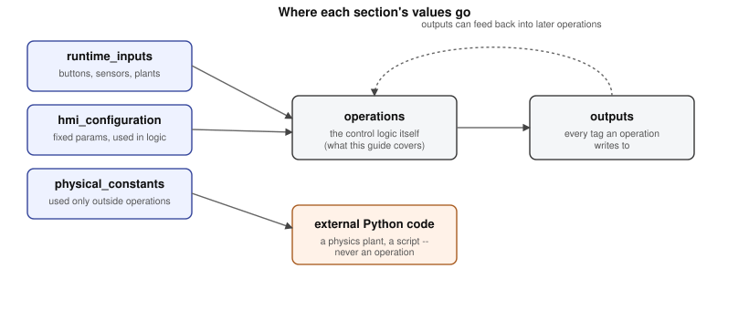
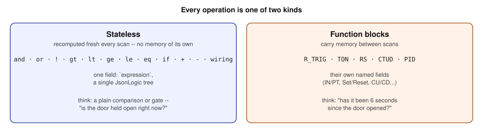

# The YAML Guide

The idea is to use a plain data structure — big dictionaries containing lists — to describe an industrial control operation with a fixed set of rules, so that an engine can always process and interpret anything written in it. Underneath that is a simple premise: any real system is built out of a finite amount of fundamental-level operations and vocabulary, and that's exactly what this format exploits. It's actually how PLC systems already work — this just makes that structure explicit, and pushes it further into an honestly logic-driven description rather than a procedural one.

The engine then takes that finite vocabulary and, with a genuinely simple algorithm, runs it at real speed — that mechanism is covered in [`engine_internals.md`](engine_internals.md), not here. This guide is about the description itself: the three design decisions that shape it are a syntax simple enough for the engine to process without ambiguity, how a file is structured, and which vocabulary of fundamental operations it's built from. That's the order this guide follows — starting with the syntax, since it's what every file and every operation is actually written in.

This guide is also deliberately **not elevator-specific**. The elevator in `example/` is one system controlled this way; the format itself doesn't know or care what it's controlling. Anything whose control logic is expressible as *signals, timers, counters, latches, simple comparisons, and simple math, re-evaluated on a fixed scan* fits the same shape — a tank-fill sequence, a traffic light, a conveyor interlock, a batching process. The physics plants in `example/Elevator_System_2` and `3` are a separate layer bolted on *underneath* the control logic — the YAML format described here is purely the decision-making layer, with no opinion about physics at all.

## Syntax

Before anything else, it's worth seeing how an operation is actually written, because the file structure and the vocabulary below are both just this one rule, applied over and over.

The core idea: every field value is a **JsonLogic node — a dict with exactly one key** — and that key's value is either a plain literal or another node. This is deliberately recursive, and that's the actual design decision worth naming: a dict can hold a list, that list can hold more dicts, each of those can hold more lists, as deep as the real decision needs to go. There's no separate expression grammar bolted on top of YAML — the recursive shape of a dictionary containing a list containing dictionaries *is* the language, which is exactly how you'd naturally write "the AND of these conditions, one of which is itself a comparison" if you were describing it in plain terms. The engine doesn't need a custom parser because of this; it just needs to know how to walk a dict and a list.

Concretely:

```yaml
{gt: [{var: "Target_Floor"}, {var: "Current_Floor"}]}
```

is a dict with one key (`gt`), whose value is a list of two elements, each of which is itself a dict with one key (`var`). Three levels of nesting, three nodes, and every level is read the same way: look at the one key, do what it says, recurse into whatever's inside it.

| Key | Shape | Meaning |
|---|---|---|
| `var` | `{var: "TagName"}` | look up a tag's current value |
| `and` / `or` | `{and: [node, node, ...]}` | variable-length boolean gate |
| `!` | `{"!": node}` | negation, wraps exactly one node |
| `gt` / `lt` / `ge` / `le` / `eq` | `{gt: [a, b]}` | exactly 2 elements |
| `if` | `{if: [condition, then, else]}` | exactly 3 elements, ternary |
| `+` / `-` | `{"+": [a, b]}` | exactly 2 elements |

Comparison and arithmetic operators accept either a nested node *or* a bare literal in each of their two slots — `{gt: [{var: "X"}, 5]}` is fine. The one thing that's never allowed is a bare literal as the field itself: `PT: 4` will crash, because `4` isn't a node at all — it has to be `PT: {var: "Some_Tag"}`, backed by an `hmi_configuration` entry. This is the single most common mistake when writing new YAML. `load_value` (on a `CTUD`) is the one deliberate exception — its value really is meant to be a plain number, not a computed condition.

There's no `max` or `abs` primitive — both get built from `if`/`gt`/`-` when needed. See the CUSUM accumulator in [`engine_internals.md`](engine_internals.md) for a real, worked example of that.

## Anatomy of a system file

Up to five top-level sections, plus `operations`:

| Section | What goes here | Shape |
|---|---|---|
| `runtime_inputs` | External signals — buttons, sensors, or anything written every scan by code *outside* the operations graph (including a physics plant) | `{type: BOOL}` or `{type: REAL}` |
| `hmi_configuration` | Fixed parameters referenced *inside* operation expressions | `{type: REAL, default: 4}` |
| `physical_constants` | Values consumed only by external Python, never by an operation | `{type: REAL, value: 9.8}` |
| `outputs` | Every tag any operation writes to — the full tag catalog | `{type: BOOL}` |
| `operations` | The actual control logic | see below |



Real excerpt, `example/Elevator_System_2/elevator_2.yaml`:

```yaml
runtime_inputs:
  Call_Floor0: {type: BOOL}
  Current_Floor: {type: REAL, note: "Written every scan by the physics plant, not an operation."}

hmi_configuration:
  Door_Hold_Time: {type: REAL, default: 6}
  Never: {type: BOOL, default: false}

physical_constants:
  Top_Floor: {type: REAL, value: 5}
  Max_Velocity: {type: REAL, value: 0.5, note: "floors/second. Per description_2.md's stated requirement: ~2 seconds per floor."}

outputs:
  Doors_Open: {type: BOOL}
  Moving: {type: BOOL}
```

Two distinctions worth being precise about:

- **`hmi_configuration` vs. `physical_constants`.** Both are fixed numbers, but only `hmi_configuration` entries get referenced inside a JsonLogic expression (`{var: "Door_Hold_Time"}`), so only they need the node-wrapping discipline described in Syntax above. `physical_constants` entries are read directly out of the loaded YAML by whichever Python code builds a physics plant or similar — nothing in the declarative graph ever needs to know a plant's natural frequency. That's also why the field is called `value`, not `default`: it signals at a glance that this number isn't part of the logic graph at all.
- **`runtime_inputs` isn't just "user-facing buttons."** Anything written every scan by code outside the operations graph belongs here — a physics plant's position output counts exactly the same as a button press. The engine doesn't distinguish the two; both are external signals that never get a producer edge in the dependency graph. That distinction is what makes certain structural upgrades possible at all — see the cycle-detection section of [`engine_internals.md`](engine_internals.md).

`type: BOOL` seeds `False`; anything else seeds `0.0`. An `hmi_configuration` entry with no `default` still runs, but gets a placeholder value and a load-time warning — a deliberate surfacing of an unconfirmed assumption, not a bug.

## Vocabulary and operations

Every entry in `operations` is one of two kinds.



**Stateless** (`and`, `or`, `!`, `gt`, `lt`, `ge`, `le`, `eq`, `if`, `+`, `-`, `wiring`) — has an `expression` field, one JsonLogic tree, recomputed fresh every scan with no memory of its own. (`wiring` is the same mechanism, used as a semantic label for a plain signal pass-through/relabel rather than any real computation.)

**Function blocks** (`R_TRIG`, `TON`, `RS`, `CTUD`, `PID`) — carry memory between scans, and have their own named fields instead of a generic `expression`. This vocabulary isn't arbitrary: `R_TRIG`, `TON`, `RS`, and `CTUD` are named directly after their equivalents in IEC 61131-3, the international standard that defines how real PLCs are programmed — this format is heavily based on that same standard function-block vocabulary, not a new invention. `PID` isn't part of the core IEC 61131-3 block list itself, but it's the near-universal standard-library block every real PLC platform ships for exactly the same control-loop role used here.

- **R_TRIG** — rising-edge detector. Field: `IN`. Outputs `True` for exactly one scan when `IN` goes False→True.
- **TON** — on-delay timer. Fields: `IN`, `PT` (preset time, seconds). Elapsed accumulates while `IN` is true, resets to 0 the instant `IN` goes false. Output is `elapsed >= PT`; it does not auto-reset once reached.
- **RS** — Set/Reset latch, Reset-dominant. Fields: `Set` (list, OR'd), `Reset` (list, OR'd).
- **CTUD** — up/down counter. Fields: `CU`, `CD` (count up/down on rising edge), `R` (reset), `LD` (load), `load_value` (the syntax exception above), `PV` (preset/max). Clamped to `[0, PV]`; precedence when several fire the same scan is R beats LD beats CU/CD.
- **PID** — Fields: `MANUAL`, `Y_MANUAL`, `RESET`, `KP`, `TN`, `TV`, `Y_MIN`, `Y_MAX`, `SET_POINT`, `ACTUAL`. `Y = KP * (error + I/TN + TV*de/dt)` — `KP` scales the whole sum, not just the P term. Anti-windup is back-calculation, so recovery after a long saturation isn't slow. Not exercised anywhere in the elevator example (a discrete-floor dispatch problem has no continuous setpoint to track), but it's part of the vocabulary for anything that does — a temperature loop, a flow-rate controller.

Every operation needs `name` (unique), `type`, and `output` (the tag it writes to). `note` and `source` are optional free-text metadata — worth using generously, since a `note` explaining *why* something is written the way it is (especially anything that looks unusual) is what makes a YAML file readable months later.

A **self-oscillating pulse**, real snippet from `example/Elevator_System_1/elevator_1.yaml` — worth seeing once, because the idiom isn't obvious from the field list alone:

```yaml
- name: "Travel_Pulse"
  type: "TON"
  IN:
    and:
      - {var: "Any_Pending"}
      - {"!": {var: "Travel_Pulse"}}
  PT: {var: "Travel_Time_Per_Floor"}
  output: "Travel_Pulse"
```

Gating `IN` on the block's own negated output makes it fire, which makes `!Travel_Pulse` go false next scan, resetting elapsed, letting it fire again — a periodic pulse built from one timer and one self-reference, no separate oscillator needed. (It's periodic, but not uniformly periodic at `PT` — every pulse after the first is `PT + 1` scans apart, a real, measured quirk of the idiom worth knowing before relying on exact timing.)

And a real `RS` + `CTUD` pair, `example/Elevator_System_1/elevator_1.yaml`, showing the field shapes above in context:

```yaml
- name: "Doors_Open"
  type: "RS"
  note: "Reset fires on either the normal hold timer OR the manual close-door button."
  Set: [{var: "Just_Arrived"}]
  Reset: [{var: "Door_Timer_Q"}, {var: "Close_Door_Button"}]
  output: "Doors_Open"

- name: "Current_Floor"
  type: "CTUD"
  note: "CU/CD compare Target_Floor against this operation's own output — a direct self-reference."
  CU:
    and:
      - {var: "Travel_Pulse"}
      - gt: [{var: "Target_Floor"}, {var: "Current_Floor"}]
  CD:
    and:
      - {var: "Travel_Pulse"}
      - lt: [{var: "Target_Floor"}, {var: "Current_Floor"}]
  R: {var: "Never"}
  LD: {var: "Never"}
  load_value: 0
  PV: {var: "Top_Floor"}
  output: "Current_Floor"
```

## Naming and documentation conventions

- Operation names: `PascalCase`, descriptive of *what* they compute, not *how* (`Doors_Open`, not `RS_Latch_3`).
- Every operation that isn't self-explanatory gets a `note` explaining *why* — especially anything unusual: a self-reference, a deliberately-dropped check, a known simplification.
- Section comments (`# --- Dispatch ---`) group operations by concept for human readability. They carry no meaning to the engine — pure documentation.

## A more complex operation, in full

Every example so far was small enough to read in one glance. It's worth seeing what the same syntax looks like once a real decision gets genuinely complicated, because that's where the recursive design actually earns its keep. `Target_Floor`, in `example/Elevator_System_2/elevator_2.yaml`, is the operation that picks which floor the car should go to next — real LOOK-algorithm dispatch: find the nearest pending call in the car's current direction of travel, or stay put if there isn't one:

```yaml
- name: "Target_Floor"
  type: "if"
  expression:
    if:
      - {var: "Going_Up"}
      - if:
          - {and: [{var: "Call_Floor1"}, {gt: [1, {var: "Current_Floor"}]}]}
          - 1
          - if:
              - {and: [{var: "Call_Floor2"}, {gt: [2, {var: "Current_Floor"}]}]}
              - 2
              - if:
                  - {and: [{var: "Call_Floor3"}, {gt: [3, {var: "Current_Floor"}]}]}
                  - 3
                  - if:
                      - {and: [{var: "Call_Floor4"}, {gt: [4, {var: "Current_Floor"}]}]}
                      - 4
                      - if:
                          - {and: [{var: "Call_Floor5"}, {gt: [5, {var: "Current_Floor"}]}]}
                          - 5
                          - {var: "Current_Floor"}
      - if:
          - {and: [{var: "Call_Floor0"}, {lt: [0, {var: "Current_Floor"}]}]}
          - 0
          - if:
              - {and: [{var: "Call_Floor1"}, {lt: [1, {var: "Current_Floor"}]}]}
              - 1
              - if:
                  - {and: [{var: "Call_Floor2"}, {lt: [2, {var: "Current_Floor"}]}]}
                  - 2
                  - if:
                      - {and: [{var: "Call_Floor3"}, {lt: [3, {var: "Current_Floor"}]}]}
                      - 3
                      - if:
                          - {and: [{var: "Call_Floor4"}, {lt: [4, {var: "Current_Floor"}]}]}
                          - 4
                          - {var: "Current_Floor"}
  output: "Target_Floor"
```

Nothing new is happening here syntactically — it's the exact same `if` / `and` / `gt` / `var` vocabulary from the table above, just nested six levels deep instead of two. Read it one level at a time: *if going up, check whether floor 1 has a call above the car and pick it; if not, check floor 2; if not, floor 3; and so on, falling back to the car's own current floor if nothing is pending in that direction at all.* The down direction, in the second branch, is the mirror image.

There's no loop anywhere, and no dedicated "find the nearest floor" primitive exists in the vocabulary at all — the entire search is just one `if` calling into another `if`, six times over. That's precisely the recursive shape from the Syntax section above, `{gt: [{var: "X"}, {var: "Y"}]}`, just deep enough that the pattern stops being trivial and starts doing real work: the same handful of dict-and-list rules, scaled up, is enough to express a genuine dispatch algorithm.

## A minimal example, outside the elevator domain

To make the "control logic for any real system, not just an elevator" claim concrete: a two-state pedestrian crossing light, with a call button and a fixed walk time, described the same way — and deliberately built using the same cycle-avoidance pattern as `Doors_Open`/`Door_Timer_Q`/`Door_Elapsed` above, as a second worked instance of that rule.

The one design point worth calling out: `Walk_Elapsed` resets on `Call_Pulse` — the *origin* event that also sets `Walk_Light_On` — not on `Walk_Light_On` itself. Resetting it on `Walk_Light_On` instead would close a cycle: `Walk_Light_On` reads `Walk_Timer_Q`, `Walk_Timer_Q` reads `Walk_Elapsed`, and `Walk_Elapsed` would then read back `Walk_Light_On`. Driving both from the same upstream event instead of chaining one off the other's output is the general fix — see [`engine_internals.md`](engine_internals.md) for the mechanism behind why that closes a cycle in the first place.

```yaml
runtime_inputs:
  Call_Button: {type: BOOL}

hmi_configuration:
  Walk_Time: {type: REAL, default: 15}
  One_Second: {type: REAL, default: 1}
  Never: {type: BOOL, default: false}

outputs:
  Call_Pulse: {type: BOOL}
  Clock_Pulse: {type: BOOL}
  Walk_Elapsed: {type: REAL}
  Walk_Timer_Q: {type: BOOL}
  Walk_Light_On: {type: BOOL}

operations:
  - name: "Call_Pulse"
    type: "R_TRIG"
    note: "The origin event: one scan long, on the press itself."
    IN: {var: "Call_Button"}
    output: "Call_Pulse"

  - name: "Clock_Pulse"
    type: "TON"
    note: "Free-running one-second pulse -- self-oscillating idiom, same as the elevator's Clock_Pulse."
    IN: {"!": {var: "Clock_Pulse"}}
    PT: {var: "One_Second"}
    output: "Clock_Pulse"

  - name: "Walk_Elapsed"
    type: "CTUD"
    note: "Counts seconds since the button was pressed. Reset on Call_Pulse (the origin event), not on Walk_Light_On -- see the note above."
    CU: {var: "Clock_Pulse"}
    CD: {var: "Never"}
    R: {var: "Call_Pulse"}
    LD: {var: "Never"}
    load_value: 0
    PV: {var: "Walk_Time"}
    output: "Walk_Elapsed"

  - name: "Walk_Timer_Q"
    type: "ge"
    expression:
      ge: [{var: "Walk_Elapsed"}, {var: "Walk_Time"}]
    output: "Walk_Timer_Q"

  - name: "Walk_Light_On"
    type: "RS"
    note: "A pure sink -- nothing reads this back into the logic above, so it's free to be reset by anything."
    Set: [{var: "Call_Pulse"}]
    Reset: [{var: "Walk_Timer_Q"}]
    output: "Walk_Light_On"
```

Same five sections, same vocabulary, same execution model — nothing elevator-specific was needed to control a completely different system.