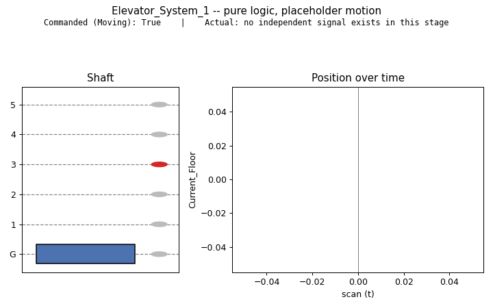
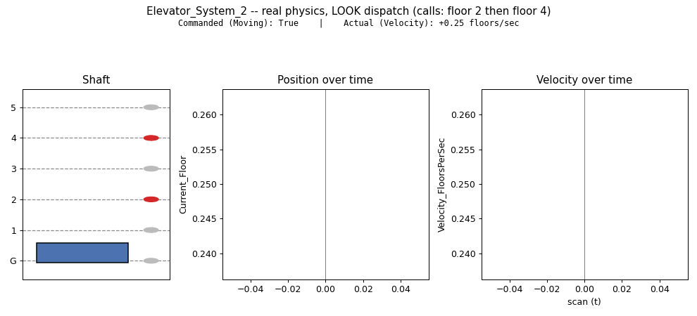
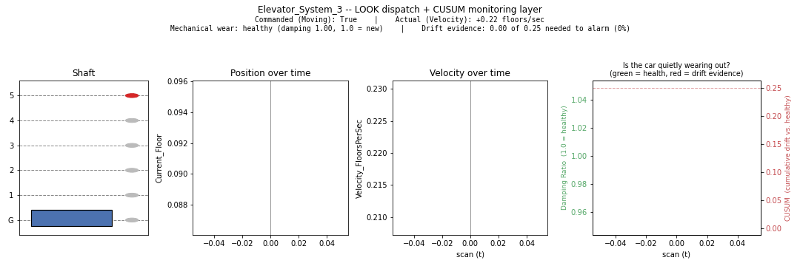

# Elevator example

The objective of this page is to show the functionality and practicality of this architecture, end to end, on one running example.

We start simple — a single elevator car serving 6 floors (G through 5) — and take it through increasing complexity of design requirements, each stage a genuine upgrade to the system rather than a rebuild, to show how modular this designing system can be. Each GIF below is a real, unedited recording of that stage's own simulation actually running — not a mockup — generated by [`make_demo_gifs.py`](make_demo_gifs.py) straight from the engine and the YAML files in this repo.

## `Elevator_System_1/`

The system described in plain language, translated into the engine's YAML format, and run as pure logic. No physical modeling yet: motion between floors is a placeholder, timer-driven rather than physical.



## `Elevator_System_2/`

The placeholder motion is replaced with a real physical plant: actual position and velocity, so trip time is a genuine output of physics, not an assumed number. This also unlocks real LOOK dispatch — the car now stops at the *nearest* pending call in its direction of travel, not just whichever call happens to be checked first.



## `Elevator_System_3/`

A monitoring layer (CUSUM, a cumulative-sum control chart) is added on top, comparing the logic's nominal expectation against the physics plant's actual behavior over time, to catch slow drift a simple threshold would miss.



This clip shows a handful of real round trips, with `Damping_Ratio` and `CUSUM_High` already visibly trending as mechanical wear accumulates. It stops well short of the actual alarm on purpose — `elevator_3.yaml`'s own tuning note puts that around 45–50 one-way trips, more than a short clip can show without either running for a very long time or subsampling frames enough to blur the per-trip physics this demo is actually trying to show. The monitoring layer itself is fully real and running in this clip; only the wear needed to trip the alarm hasn't accumulated yet.

## Reproducing these demos

```
cd example
python make_demo_gifs.py
```

Regenerates all three GIFs above into `assets/`, from the real engine and the real YAML files — nothing about them is hand-drawn or scripted around the point being made.

---

Each stage builds on the last without modifying it — that's the actual point being demonstrated: the same core graph stays intact as capability gets added around it.